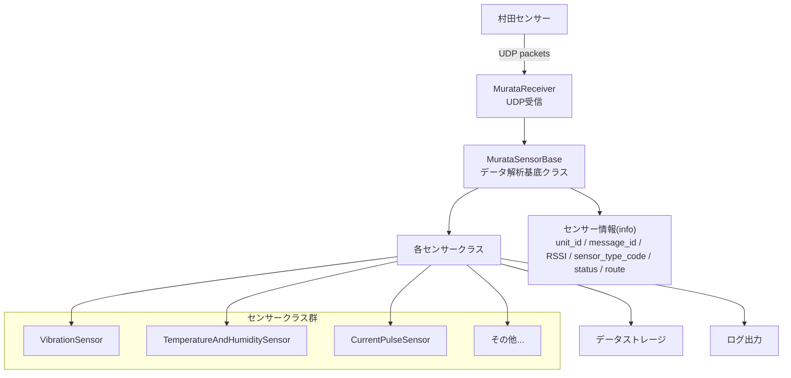

# システムアーキテクチャ設計書

## 概要

村田製作所製無線センサユニットデータ受信ライブラリ

### システム目的
- 村田製作所製センサーからのUDPパケットを受信・解析
- 複数のセンサータイプに対応した柔軟なデータ処理
- センサーデータの履歴管理と最新データの提供

### 対応センサータイプ
- 温湿度センサー
- 振動センサー
- 電流・パルスセンサー
- 電圧・パルスセンサー
- CTセンサー
- 熱電対センサー
- その他複数タイプのセンサー

## アーキテクチャ概要

## モジュール構成

### 1. センサー受信モジュール
- **murata_receiver.py**: 同期UDP受信とセンサーデータ管理
  - `MurataReceiver`: UDPソケット管理、コールバック（data_callback / error_callback）、`run_in_thread()`
  - センサーデータの履歴管理（送信元あたり最大1000件）
  - センサータイプ別インスタンス生成、`create_sensor()`, `parse_text_line()`
- **async_receiver.py**: 非同期（asyncio）UDP受信
  - `AsyncMurataReceiver`: `async start()` / `async stop()`、`async for` でセンサーデータ取得

### 2. センサーデータ解析モジュール
- **murata_sensor.py**: センサーデータの解析処理
  - `MurataSensorBase`: 基底クラス
  - 各センサー固有のデータ解析クラス
  - チェックサム検証
  - RSSI値計算
  - センサ種別コード（sensor_type_code）の抽出と `info` への格納

### 3. 例外処理モジュール
- **murata_exception.py**: カスタム例外定義
  - `MurataExceptionBase`: 例外基底クラス
  - `FailedCheckSum`: チェックサムエラー
  - `FailedCheckSumPayload`: ペイロードチェックサムエラー

### 4. データベースモジュール（未実装）
- **db/**: データベース関連機能（現在はコメントアウト）
  - SQLAlchemy ORM設定
  - データモデル定義

### 5. テストモジュール
- **tests/**: テストケース
  - 単体テスト（現在は基本構造のみ）

## データフロー

1. **データ受信**
   - UDPソケット（port: 55039）でセンサーからのパケットを受信
   - パケット形式: ERXDATA形式

2. **データ解析**
   - パケットヘッダー解析
   - ペイロード抽出
   - チェックサム検証
   - センサータイプ判定

3. **センサーインスタンス生成**
   - センサータイプに応じた専用クラスのインスタンス化
   - センサー固有のデータ解析処理

4. **データ格納・管理**
   - 送信元IPアドレス別にデータ管理
   - 履歴データ保持
   - 最新データへのアクセス提供

## 設計パターン

### 1. Factory Pattern
- `MurataReceiver._create_sensor_instance()`: センサータイプに応じたインスタンス生成

### 2. Template Method Pattern
- `MurataSensorBase`: 共通の解析フローを定義
- 各センサークラスで具体的な解析処理を実装

### 3. Strategy Pattern
- センサータイプ別の解析戦略を各クラスで実装

